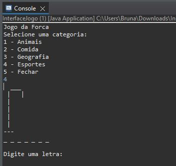
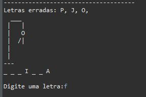
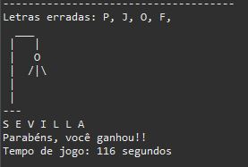
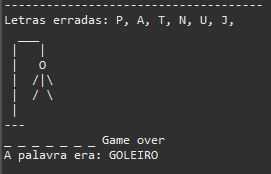

[JAVA_BADGE]: https://img.shields.io/badge/java-%23ED8B00.svg?style=for-the-badge&logo=openjdk&logoColor=white
[ECLIPSE_BADGE]: https://img.shields.io/badge/Eclipse-FE7A16.svg?style=for-the-badge&logo=Eclipse&logoColor=white

<h1 align="center" style="font-weight: bold;">🧩 Jogo da Forca 💻🔠</h1>

🌐 <a href="#ingles"> _English README</a> below the portuguese_

![JAVA_BADGE]
![ECLIPSE_BADGE]

<p align="center">
  <a href="#sobre">Sobre</a> • 
  <a href="#comecando">Começando</a>
</p>

<p align="center">
  
  
  
  
</p>

<h2 id="sobre">📖 Sobre</h2>

Projeto de um jogo da forca em Java com 4 categorias: Animais, Comidas, Esportes e Geografia.

🐾 Animais: nomes de animais

🍽️ Comidas: nomes de alimentos ou pratos

🏅 Esportes: nomes de esportes, times ou vocabulário esportivo

🗺️ Geografia: nomes de países ou termos geográficos

<h4>📚 Estudo</h4>
Esse projeto é uma aplicação para estudo de desenvolvimento na linguagem Java, seguindo boas técnicas de programação, princípios SOLID, padrões de projeto e threads.

<h2 id="comecando">🚀 Começando</h2>

Para testar o projeto em sua máquina, é necessário seguir os passos abaixo:

<h3>Pré-requisitos</h3>

- [Eclipse](https://eclipseide.org/) (2022-09 ou superior ou outra IDE Java de sua preferência)

<h3>Clonando</h3>

Como clonar

```bash
git clone https://github.com/brunaciarlo/jogoDaForca.git
```

Iniciar a IDE Java (nesse exemplo usaremos o Eclipse)

Selecione `File >> New >> Open Projects from File System >> Directory >>` e selecione a pasta clonada ` >> Finish`

Após o projeto carregar completamente, entre em `src >> jogo >> InterfaceJogo.java` e rode a aplicação.

---------------------------------------------------------------------------------------------------------------------------------------

<h1 id="ingles" align="center" style="font-weight: bold;">🧩 Hangman 💻🔠</h1>

![JAVA_BADGE]
![ECLIPSE_BADGE]

<p align="center">
  <a href="#about">About</a> • 
  <a href="#starting">Getting Started</a>
</p>

<p align="center">
  
  
  
  
</p>

<h2 id="about">📖 About</h2>
Project of a hangman game in Java with 4 categories: Animals, Foods, Sports, and Geography.

🐾 Animals: names of animals

🍽️ Foods: names of foods or dishes

🏅 Sports: names of sports, teams, or sports vocabulary

🗺️ Geography: names of countries or geographical terms

<h4>📚 Study</h4>
This project is an apliccation for Java learning. Usying clean code, SOLID principles, design patterns and threads.

<h2 id="starting">🚀 Getting Started</h2>

To test the project on your machine, follow the steps bellow:

<h3>Prerequisites</h3>

- [Eclipse](https://eclipseide.org/) (2022-09 or latest or another Java IDE)

<h3>Cloning</h3>

How to clone

```bash
git clone https://github.com/brunaciarlo/jogoDaForca.git
```

Start your Java IDE (in this case, we'll be usying Eclipse)

Click `File >> New >> Open Projects from File System >> Directory >>` and select the clone folder ` >> Finish`

After loading the project, click `src >> jogo >> InterfaceJogo.java` e run the application.
